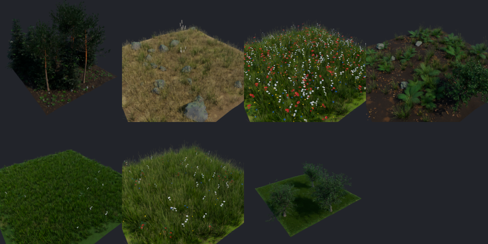
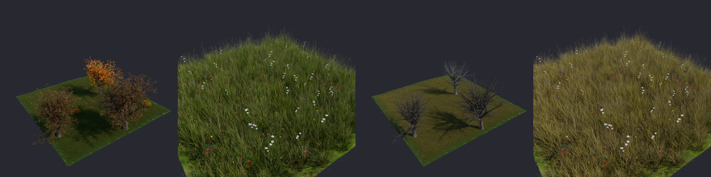
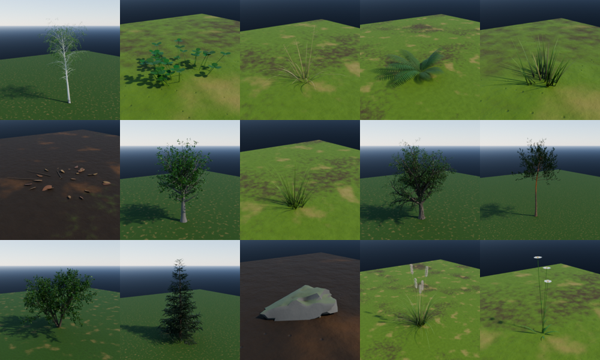

# Verdant

**Free, open source procedural vegetation for Blender.** A small library of
grass, wildflowers, ferns and trees, a scatter system that stacks layers on
any mesh, and ready-made vegetation patches you can drop into a scene.

- No image textures and no bundled `.blend` files: every plant and material is
  generated from Python and standard shader nodes.
- Scattered plants are instances, so dense lawns stay light in memory.
- Scenes keep rendering without the add-on installed.

## Features

- **15 species, 43 variants**, in four categories:
  - **Grass**: lawn grass, meadow grass with seed heads, tall tufts with feathery
    plumes, and dry grass.
  - **Plants**: wildflowers (daisy, poppy, cornflower and buttercup), clover with
    or without flowers, and ferns.
  - **Trees**: oak, birch, maple, spruce, Scots pine and a multi-stem shrub.
  - **Ground**: stones and leaf litter.
- **Real detail without textures**:
  - Grass blades are folded and tapered, with a darker base and colour
    variation per blade and per clump.
  - Leaves have species outlines (lobed oak, serrated birch, palmate maple), a
    raised midrib, veins, a lighter underside and translucency.
  - Bark comes in five styles:
    - Furrowed oak.
    - White birch with lenticels.
    - Smooth maple.
    - Plated spruce.
    - Scots pine, with deep grey-brown plates at the base that turn into thin,
      flaking copper bark higher up.
- **Place on Surface**: click anywhere on the ground to plant a single tuft,
  flower, stone or tree, or drag to paint several. Plants get a random variant,
  size and turn. Grass grows straight up even on slopes, while stones and leaf
  litter follow the surface.
- **Scatter layers** (geometry nodes). Each layer is one modifier, so layers
  stack: grass, then flowers, then trees. Each layer has these controls:
  - Density and minimum spacing (Poisson disk).
  - A share of instances to show in the viewport.
  - Random scale, rotation and tilt.
  - Alignment to the surface normal and a slope limit.
  - A vertex-group or attribute mask, which can be inverted.
  - Patchiness, which grows plants in natural clumps.
- **Scatter your own objects**: select them, then the target, and click
  *Scatter Selected Objects on Active*.
- **7 ready-made patches**: Lawn, Meadow, Wildflower Field, Forest Floor, Park,
  Conifer Forest and Dry Grassland. Each patch is a gently uneven ground with a
  matching ground material and stacked layers. It can be square or round with
  a wavy edge, and plants thin out toward the border. Size and seed are
  adjustable.
- **Seasons**: one switch for the whole scene.
  - Spring makes greens fresher.
  - Autumn colours each tree differently and dries out some grass.
  - Winter leaves broadleaf trees bare and turns grass to straw.

## Requirements

Blender 4.2 or newer (tested on 5.2 LTS). Cycles or EEVEE. Windows, macOS or Linux.

## Install

1. Download `verdant-x.y.z.zip` from the [Releases](../../releases) page. Don't unzip it.
2. In Blender, go to *Edit → Preferences → Get Extensions*, open the **⌄** menu
   at the top right, choose **Install from Disk…**, and pick the zip.

## Use

Everything is in the 3D Viewport: **Sidebar (N) → Verdant**.

- **Library**: pick a category and a species. *Variant* chooses one variant, or
  *Mixed* for all of them.
  - *Place on Surface*: click on any surface to plant one, or drag to paint.
    Right-click or Esc finishes. You can still orbit, pan and zoom while
    placing. *Paint Spacing*, *Scale Random* and *Align to Surface* tune it.
  - *Add at Cursor* places the plant at the 3D cursor.
  - *Scatter on Selected* adds a scatter layer to every selected mesh.
- **Patches**: pick a patch, a size, a shape and a seed, then click *Add Patch*.
- **Scatter Layers**: shows the layers on the active object. Each layer can be
  hidden, given a new seed, removed, or tuned.
  - Paint the `vd_density` vertex group on a patch (or any group you set as the
    *Mask*) to control where plants grow.
- **Season**: Spring, Summer, Autumn or Winter.

### Tips

- Dense layers such as lawn grass default to a low *Viewport Amount*. Renders
  always use the full density.
- Generated plants live in a *Verdant Library* collection that is not linked to
  the scene. To edit a plant, link that collection into the scene and edit the
  meshes. Every instance updates.
- Use *Apply* on a scatter modifier only if you need real geometry: it creates
  every instance as real mesh data.

## License

GPL-3.0-or-later. See [LICENSE](LICENSE). Everything Verdant generates is yours
to use without restriction.
